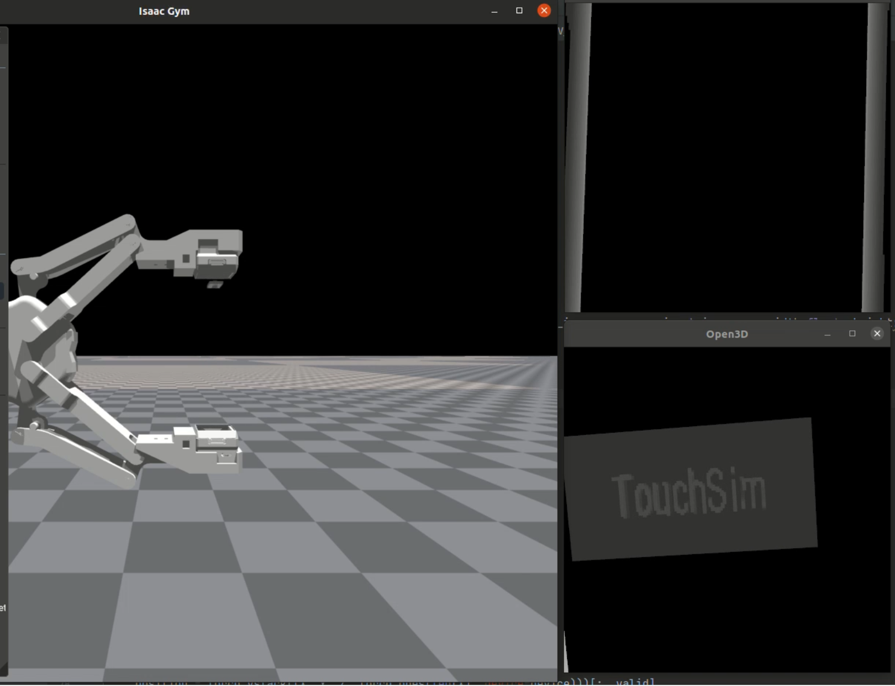
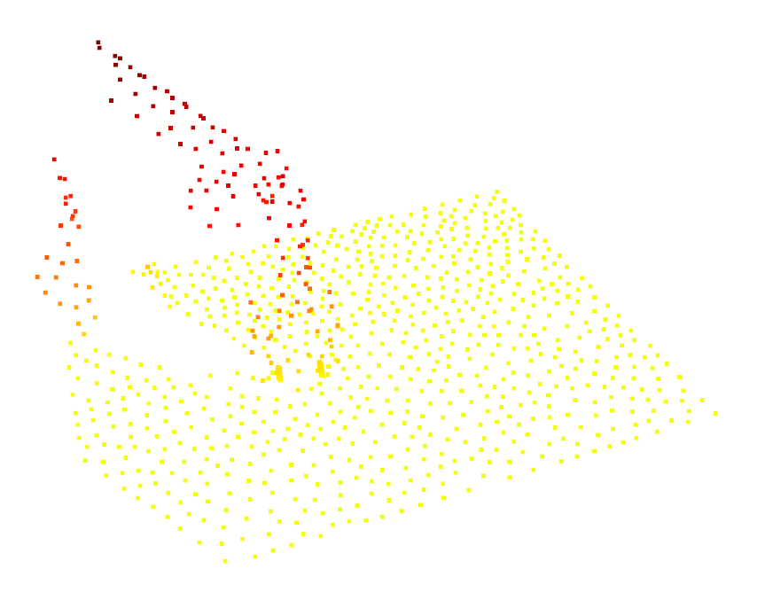
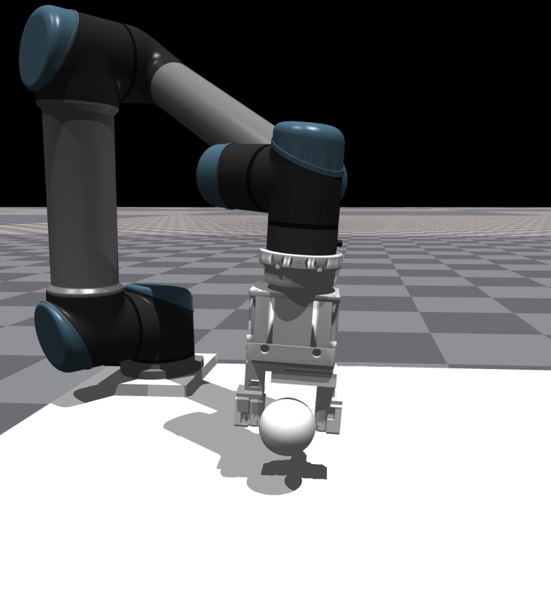
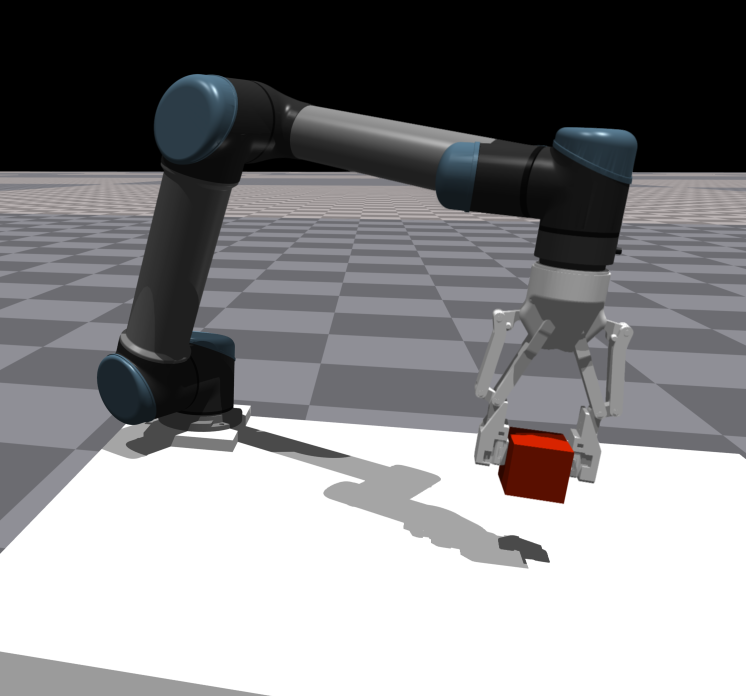

[](https://developer.nvidia.com/isaac-gym)
[](https://docs.python.org/3/whatsnew/3.8.html)
[](https://releases.ubuntu.com/20.04/)
[](https://opensource.org/license/mit)

##  1. VisualTactileGym


### Tactile simulation
This project provides tactile simulation on the isaacgym platform and is managed uniformly through point clouds and six dimensional forces, which can be used as input together with camera point clouds.
<p align="center">
  
  
</p>

### Custom ( Robot Arm / Gripper / Tactile Sensor )
At the same time, this simulation supports different robot systems
<p align="center">
  
  
</p>

<br>

## 2. Dependencies
Some dependencies can be installed by

```sh
pip install -r ./requirements.txt
```
### [Isaac Gym](https://developer.nvidia.com/isaac-gym)

Our framework is implemented on Isaac Gym simulator, the version we used is Preview Release 4. You may encounter errors in installing packages, most solutions can be found in the official docs.

### [Pointnet2](https://github.com/daerduoCarey/where2act/tree/main/code)

Install pointnet++ manually.

```sh
cd {the dir for packages}
git clone --recursive https://github.com/erikwijmans/Pointnet2_PyTorch
cd Pointnet2_PyTorch

pip install -r requirements.txt
pip install -e .
```

Finally, run the following to install other packages.

```sh
# make sure you are at the repository root directory
pip install -r requirements.txt
```

### Assets（Optional）
Google Drive Link: https://drive.google.com/file/d/16qATmRousv1vgVg3yQnahmRkPLoQ8lzG/view?usp=drive_link


<br>

## 3. Training

Tensorboard logdir :/run

### 1. RL (without tactile and visual pointcloud)
For env  modify this file :   cfg/task/xxxx.yaml  <br>
  numEnvs : 512+        <br>                                   
  obs_type: ["oracle"] <br>
  
For algo modify this file:    cfg/train/sac/sac_xxxx.yaml   <br>
  load_iter: when rl model saved   <br>
```sh
python3 train.py --task xxxx --algo sac --headless
```
For testing:
```sh
python3 train.py --task xxxx --algo sac --headless --test
```

### 2. RL or Custom Algo (With tactile or visual pointcloud) 
For env  modify this file :   cfg/task/xxxx.yaml  <br>
  numEnvs : 16+                                  
  obs_type: ["oracle","tactile","pointcloud"] <br>

Other config files are the same as RL  <br>
```sh
python3 train.py --task xxxx --algo custom --headless
```
For testing:
```sh
python3 train.py --task xxxx --algo custom --test --headless
```

## Reference
https://github.com/PKU-MARL/DexterousHands
https://github.com/hyperplane-lab/RLAfford
